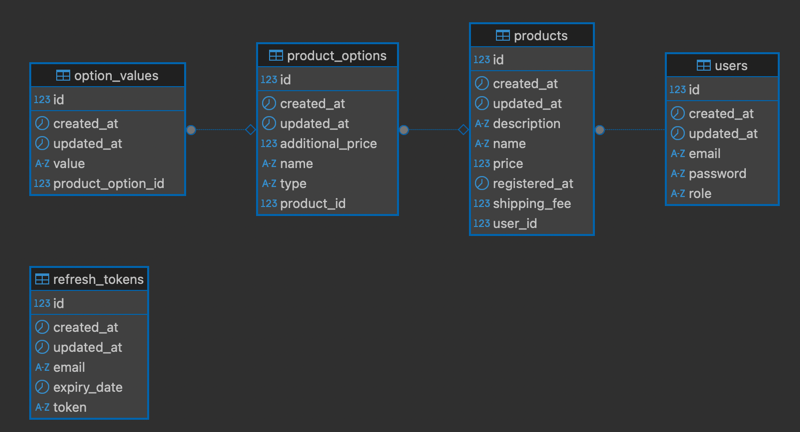
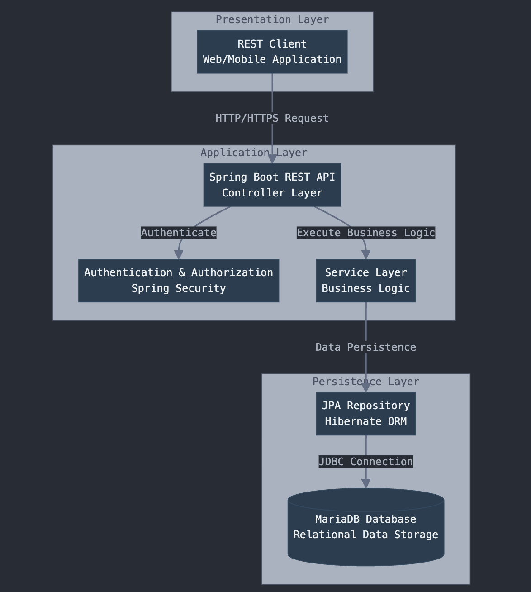
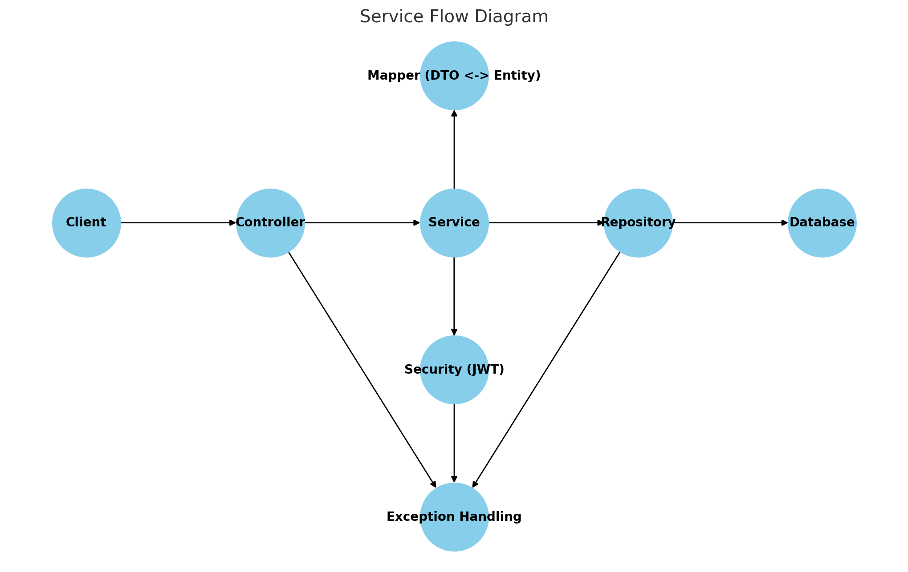

프랜킷 백엔드 개발 지원자 김기원

# FrankIt Shop API
## 프로젝트 개요
FrankIt Shop API는 온라인 상품 관리 시스템의 백엔드 API 서비스입니다. 이 API는 사용자 인증, 상품 관리, 상품 옵션 관리 기능을 제공합니다.

## 프로젝트 패키지 구조
- dto: 데이터 전송 객체(DTO)
- repository: 데이터베이스 리포지토리
- config: 애플리케이션 설정
- security: 인증 및 권한 부여
- entity: JPA 엔티티
- mapper: 엔티티-DTO 변환
- controller: HTTP 요청 처리
- service: 비즈니스 로직
- exception: 예외 처리
- FrankitApplication.java: 애플리케이션 시작

### ERD

### 시스템 아키텍처 및 서비스 플로우 다이어그램

## 코드 구조
- [코드구조](https://kkwdev.notion.site/1aa096fc2e1580528498dba1b5413752?pvs=4)

### API 명세서
- [FrankIt Shop API Doc](https://www.notion.so/kkwdev/API-1a7096fc2e158085b4d5e39961df52b1?pvs=4)

## 기능 정의 명세서 및 개념적 데이터 모델링
- [기능 정의 명세서 및 개념적 데이터 모델링 문서](https://kkwdev.notion.site/1a8096fc2e1580f5af90ddf58a61dac4?pvs=4)

## 확장성 고려한 코드 설계 문서
- [확장성 고려한 코드 설계 문서](https://kkwdev.notion.site/1aa096fc2e15809682a0ef37d076bb62?pvs=4)

### 프로젝트 개발시 요구사항 이외 추가 고려사항
- 보안 강화 및 확장성을 고려한 아키텍처 설계
  - JWT 인증시 Access Token, Refresh Token 활용
  - Access Token 짧은 만료시간으로 보안 강화
  - Refresh Token을 통한 Access Token 재발급
  - Refresh Token DB 저장을 통한 중앙 관리
  - Spring Security를 통한 중앙화된 인증 처리
  - 사용자 역할에 따른 접근 제어(일반 유저, 관리자)
- 객체지향 설계 원칙 적용
  - 단일 책임 원칙 적용을 통한 유지보수 및 확장성있는 코드 작성
    - 클래스, 메서드 최소 책임 위임
    - Controller와 Serice Layer의 역할, 책임 분리, Controller는 Client와 HTTP 통신, Service는 비즈니스 로직 집중
    - GlobalExceptionHandler를 통한 일관된 예외처리
    - BaseEntity 등 공통 필드 부모클래스 상속 처리
    - Entity와 DTO 분리, Mapper Class 활용을 통한 명확한 데이터 변환 및 유지보수 용이한 코드 설계
  - 의존 역전 원칙, 리스코프 치환 원칙 적용, 인터페이스 의존을 통한 객체간 결합 최소화, 변경에 유연한 코드 설계
- 프론트엔드와의 협업 지향적 설계
  - 프론트엔드 개발자가 보기 쉬운 API 설계 문서화
    - 요청 응답 예시 JSON 제공
  - ReponseEntity 객체를 통한 일관성 있는 응답 방식 설계
  - 잦은 사용자 인증 방지를 위한 Refresh Token 활용 Access Token 재발급 기능 추가 개발
- git을 통한 버전 관리
  - 최소 단위 커밋
  - branch 전략을 통한 코드 관리
- 리팩토링
  - 일관된 코드 구조 등 코드 품질 향상을 위한 리팩토링

### 기술 스택
- Language : Java 23
- Framework : Spring Boot 3.4.3
- Database: MySQL
- ORM : Spring Data JPA
- Authentication : Spring Security + JWT(JSON Web Token)
- API Doc: Notion
- Build Tool : Gradle